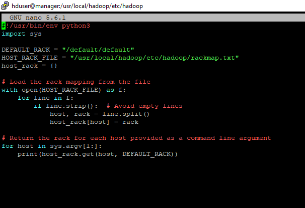
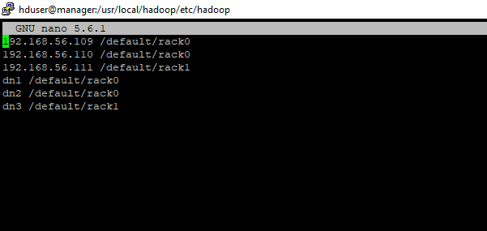
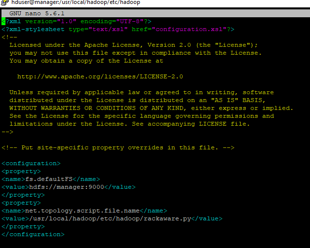
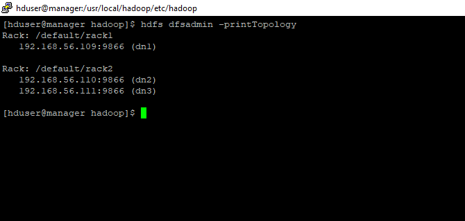
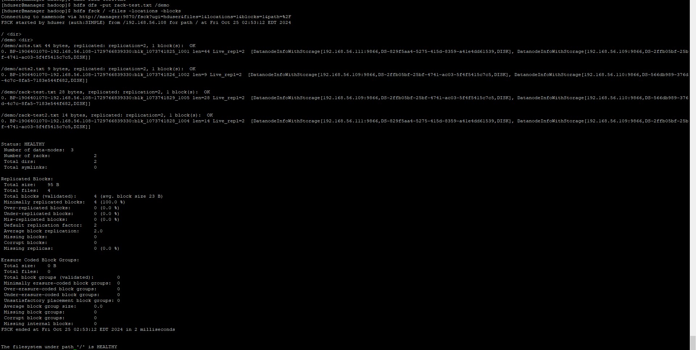

# Hadoop Rack Awareness Configuration

## Overview
Rack awareness in Hadoop is an essential feature that allows the cluster to understand the physical topology of nodes across different racks. By using this configuration, you can implement rack awareness to improve data placement strategies, resulting in optimized performance, fault tolerance, and efficient network usage within the Hadoop ecosystem.

### Why Use Rack Awareness?
- **Data Locality**: Minimizes network traffic by storing data closer to the compute nodes processing it.
- **Fault Tolerance**: Ensures data redundancy by placing replicas on different racks.
- **Network Traffic Management**: Reduces cross-rack data transfer, improving performance.

## Setup Instructions

Follow these steps to configure rack awareness in your Hadoop cluster:

### Step 1: Create Rack Mapping File
Define your rack setup in `rackmap.txt`. Place nodes in their respective racks.

**rackmap.txt Example**
```
192.168.56.109 /default/rack1   # node1
192.168.56.110 /default/rack2   # node2
192.168.56.111 /default/rack2   # node3
dn1 /default/rack1
dn2 /default/rack2
dn3 /default/rack2
```

### Step 2: Create Rack Awareness Script
Create the Python script `rackaware.py` to read the rackmap.txt file and return rack details.

**rackaware.py Example**
```python
#!/usr/bin/env python3
import sys

DEFAULT_RACK = "/default/default"
HOST_RACK_FILE = "/usr/local/hadoop/etc/hadoop/rackmap.txt"
host_rack = {}

# Load the rack mapping from the file
with open(HOST_RACK_FILE) as f:
    for line in f:
        if line.strip():  # Avoid empty lines
            host, rack = line.split()
            host_rack[host] = rack

# Return the rack for each host provided as a command line argument
for host in sys.argv[1:]:
    print(host_rack.get(host, DEFAULT_RACK))
```

### Step 3: Make Script Executable
Make `rackaware.py` executable:
```bash
chmod +x /usr/local/hadoop/etc/hadoop/rackaware.py
```

### Step 4: Update core-site.xml
Modify `core-site.xml` to use the new rack awareness script.

**core-site.xml Example**
```xml
<configuration>
    <property>
        <name>fs.defaultFS</name>
        <value>hdfs://manager:9000</value>
    </property>
    <property>
        <name>net.topology.script.file.name</name>
        <value>/usr/local/hadoop/etc/hadoop/rackaware.py</value>
    </property>
</configuration>
```

### Step 5: Restart Hadoop Services
Restart your Hadoop services to apply changes:
```bash
stop-all.sh
start-all.sh
```

### Step 6: Verify Rack Awareness
Verify the setup:
```bash
hdfs dfsadmin -printTopology
```


<br>
<br>


## Implementation Screenshots:-

1. Rackaware.py :- Its python script file.

    

 

 2. Rackmap.txt file :-  This file contains all Datanodes IP’s and there host name for maping.

   


 
3. Core-site.xml file configuration:-

   

 

4. Hdfs print Topolog:-


   

 

5. File Information of  rack-test.txt :-    hdfs fsck / -files –locations –blocks

 

  
